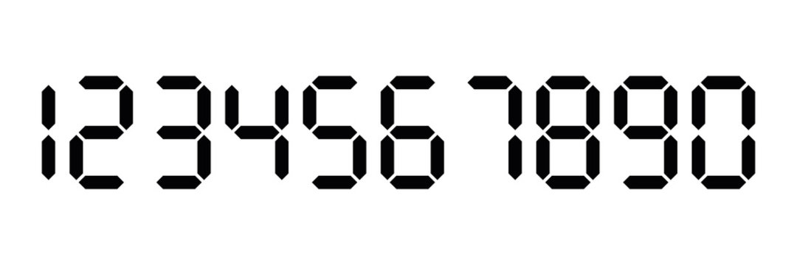

# Number to LCD



# Notas.

Este codigo fue desarrollado en el lenguaje de programación Javascript.

## ¿Cómo ejecutar el código?.

### Primeramente Ejecute:
```
npm install 
```
### Ponga a prueba el codigo:
Para ejecutar el código es necesario ingresar primero el número a convertir, el ancho y por último el alto.

Ejemplo:
```
node ExecuteMe 2 3 2
```
(En caso de no ingresar el ancho y alto, los valores predeterminados serán 1 y 1).
